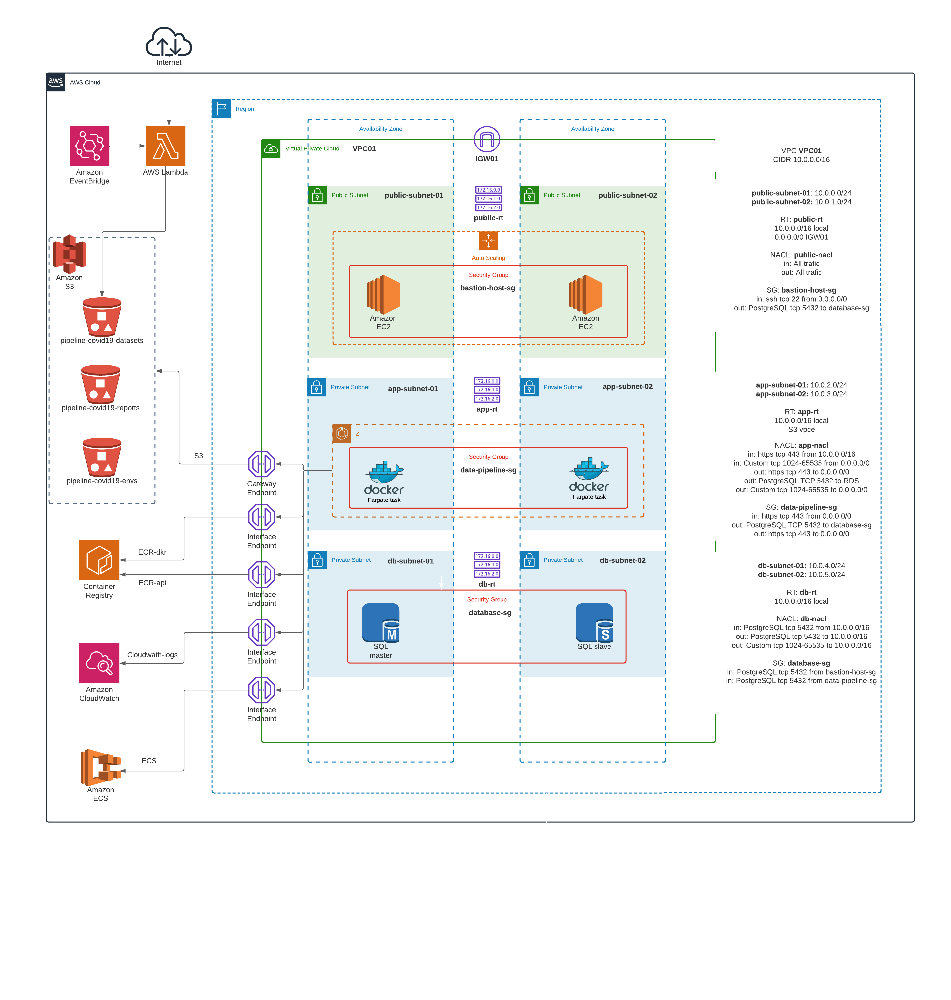

# Data pipeline covid19 en AWS ECS + RDS
 

### Resumen

Se adapto el data pipeline presentado en el TP final de foundations para que corra en AWS ECS, con tareas de tipo Fargate pero utilizando una RDS PostgreSQL como base de datos.
Se expone a continuación la topología de red utilizada.
    

  

